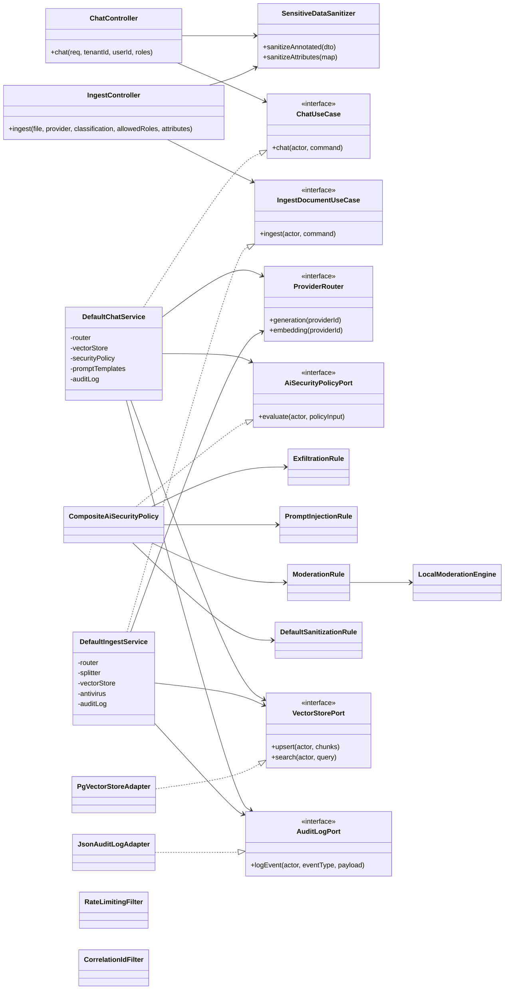

# Diagramme de classes et cas d'usage (réel)

Ce diagramme a été construit à partir de la structure du code (controllers, use cases, ports, adapters, policy engine) selon l'architecture hexagonale du projet.

## Affichage en image

Si ton viewer Markdown n'interprète pas Mermaid, génère une image locale :

```bash
./docs/diagrams/render-mermaid.sh
```

Puis ouvre :
- `docs/diagrams/use-cases-class-diagram.svg`

Image générée (locale) :



## Diagramme de classes



## Cas 1 — Utilisation normale

1. `CorrelationIdFilter` lit/génère `X-Correlation-Id`.
2. `RateLimitingFilter` valide le quota.
3. `ChatController` reçoit la requête et construit le contexte acteur.
4. `DefaultChatService` fait la recherche RAG via `VectorStorePort`.
5. `AiSecurityPolicyPort` évalue et retourne `ALLOW`.
6. `ProviderRouter` sélectionne le provider de génération.
7. Réponse + citations + audit JSON.

## Cas 2 — Anonymisation

1. `ChatController` appelle `SensitiveDataSanitizer.sanitizeAnnotated(req)`.
2. Les champs sensibles sont masqués/redactés.
3. Le use case travaille uniquement avec la version sanitizée.
4. Le modèle ne reçoit pas les données brutes sensibles.

## Cas 3 — Attaques (types)

1. Exfiltration directe (`reveal system prompt/api key`) :
`ExfiltrationRule` => `BLOCK`.

2. Prompt injection via contexte RAG (`ignore previous instructions`) :
`PromptInjectionRule` => `ALLOW_WITH_SANITIZATION`.

3. Prompt violent/abusif :
`ModerationRule` + `LocalModerationEngine` => sanitization ou blocage selon score.

4. Flood d'API :
`RateLimitingFilter` => `429 rate_limit_exceeded`.
